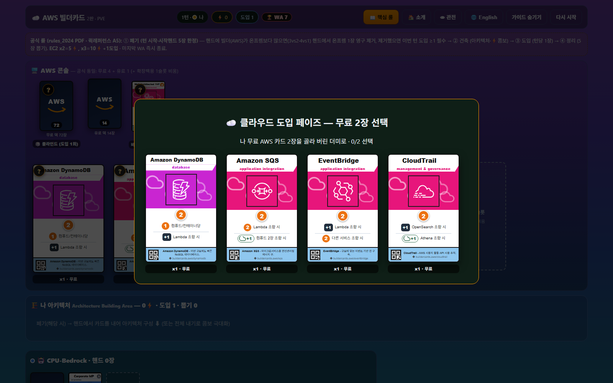
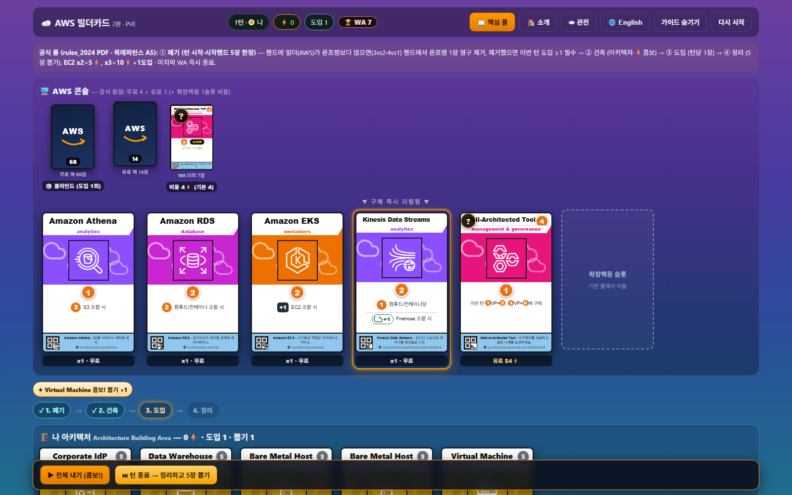
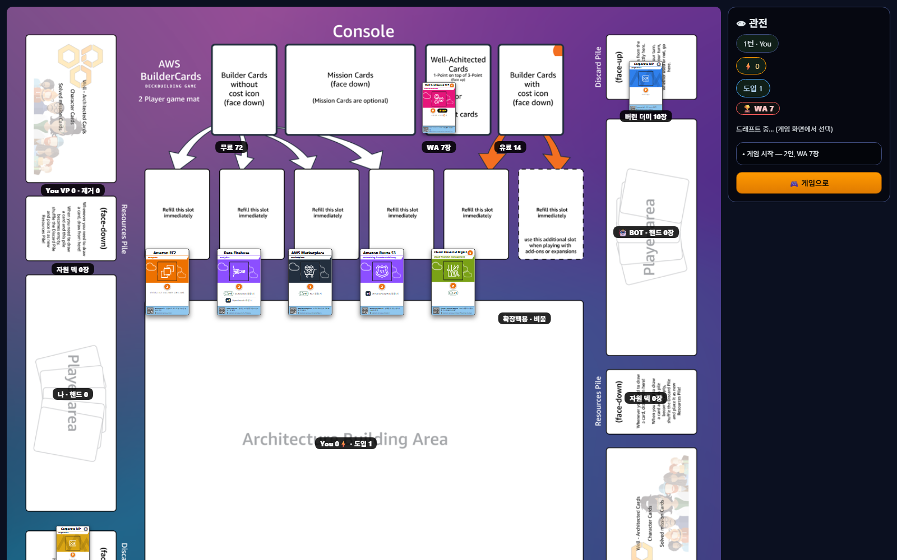
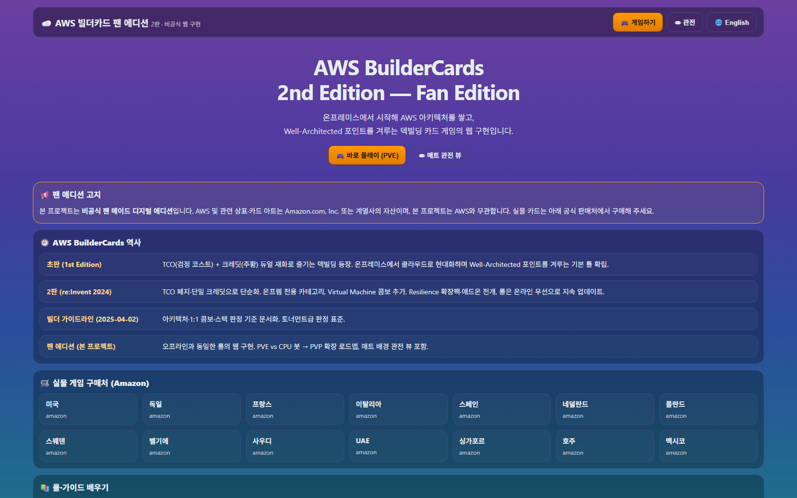

# AWS BuilderCards 2nd Edition — Fan Edition (Web)

[](./README.md)
[](./README.ko.md)
[](./README.ko.md)
[](#-라이선스고지)
[](#-로드맵)
[](#-시작하기)
[](#-기술-스택)
[](#-기술-스택)
[](#-기술-스택)

온프레미스에서 시작해 AWS 아키텍처를 쌓고 Well-Architected 포인트를 겨루는 덱빌딩 카드 게임,
**AWS BuilderCards 2nd Edition의 비공식 웹 팬 에디션**입니다. 오프라인과 동일한 룰로 PVE부터 플레이할 수 있습니다.

> 📢 **Fan-made project.** 비공식 팬 메이드이며 AWS와 무관합니다.
> AWS 및 관련 상표·카드 아트는 Amazon.com, Inc. 또는 계열사의 자산입니다.
> 실물 카드는 [공식 판매처](#-실물로-즐기기)에서 구매해 주세요.

- 🎮 게임: `#` (기본 화면)
- 👁 매트 관전 뷰: `#observer`
- 🏠 소개 페이지: `#introduce`

## 📸 스크린샷

| 드래프트 페이즈 | 게임 보드 |
|---|---|
|  |  |
| 매트 관전 뷰 | 소개 페이지 |
|  |  |

## ✨ 특징

- **오프라인 동일 룰 엔진** (`src/game/engine.ts`): 4페이즈 턴(폐기→건축→도입→정리), EC2 스택, 41종 카드 콤보 전부 구현
- **PVE 모드**: 휴리스틱 CPU 봇(CPU-Bedrock) — 드래프트·폐기·구매 자동 진행
- **포커 테이블급 연출** (사행성 없음): 카드 플립/팬 모션, 콤보 파티클, WebAudio 신스 효과음
- **공식 2P 매트 배경 관전 뷰**, 턴 스테퍼, 핵심 룰 모달, 호버·터치 툴팁, 카드 퀵줌(롱프레스), 구조화 로그, 봇 제어(일시정지/빨리넘기기)
- **PVP-Ready**: 게임 상태 전체 JSON 직렬화, 액션 단위 스토어 — WebSocket 서버만 붙이면 확장 가능

## 🚀 시작하기

```powershell
npm install
npm run dev      # http://localhost:5173
npm run build    # dist/ 프로덕션 빌드
```

Node.js 20+ 권장.

## 📏 룰 요약 (공식 기준)

- **준비**: 온프렘 10장 + 콘솔 무료 2픽 → 12장 셔플 → 5장 드로우
- **콘솔**: 무료 4슬롯 + 유료 1슬롯(중복 스택, 구매 즉시 리필) + WA 더미(1VP가 위) + 블라인드. 6번째 점선 슬롯은 확장팩용으로 기본 룰에서 비움
- **턴**: ① 폐기(턴 시작·시작핸드 한정, 핸드 빌더 > 온프렘 → 1장 영구 제거, 제거 시 도입 ≥1 필수) → ② 건축(콤보) → ③ 도입(기본 1회) → ④ 정리(전부 버리고 5장)
- **EC2 스택**: 1장=2⚡ · 2장=5⚡ · 3장=10⚡+도입 1
- **종료**: 마지막 WA 획득 즉시 종료 → VP 합산 (동점은 AWS 카드 수)

### 원본 대비 디지털 구현 메모 (검증済)

| 항목 | 구현 | 근거 |
|---|---|---|
| 온프렘 크레딧 | 0 (콤보 재료로만 사용) | 빌더 가이드라인 p.4 (CF 2+S3 2+VM = 4⚡) |
| 폐기 판정 | 시작핸드 5장 기준, 핸드에서만 | 공식 룰북 + 퀵레퍼런스 A5 |
| ELB 콤보 | 컴퓨트/컨테이너당 +2⚡ | 빌더 가이드라인 p.4 (3×2=6⚡) |
| WA 획득 카드 | 버린 더미로 (공식 "긴 플레이" 변형) | 룰북: 기본은 별도 더미, 변형으로 덱행 허용 |
| Free 풀 | 76장 (공식 구성표) | 룰북 p.11 (초안 데이터셋 77장 → 정정: IAM ×3, Systems Manager ×2) |
| 스타터 | 색상당 10장: Bare Metal ×3, Code Repository 없음 | 룰북 p.11 구성표 |
| 아키텍처 배치 | 좌/우 측면·스택 미모델링 (co-presence 판정) | 디지털 단순화 |
| Blind 도입 | 0⚡, 도입 1회 소모 | 룰북 (추가 크레딧 언급 없음) |

## 🗂 프로젝트 구조

```
src/
  game/       cards.json (정본 카드 DB, 한/영 쌍 — 번역·재배포는 이 파일만 수정)
              cards.ts (JSON 로더 + 로케일 헬퍼) / engine.ts (순수 룰) / bot.ts (PVE 휴리스틱)
  ...
scripts/      cards.py (번역 워크플로: `cards:template` 추출 / `cards:import` 반영)
translation-template.csv  (cards.json에서 생성되는 번역 시트)
```

## 🗺 로드맵

- [x] PVE + 오프라인 동일 룰 + 관전 뷰 + P0 UX
      (스테퍼·퀵줌·가드·구조화 로그·a11y·봇 제어)
- [ ] P1: 온보딩 코치마크, 구매 확인·미리보기, WA 종료 긴박감, 반응형 정리
- [ ] PVP: WebSocket 룸 서버, 액션 브로드캐스트, 핸드 비공개 관전, 재접속 복원

## 🛒 실물로 즐기기

- 공식 페이지: https://aws.amazon.com/gametech/buildercards/
- 구매 (Amazon, 상품코드 `B0F13C68J6`): [미국](https://www.amazon.com/dp/B0F13C68J6) ·
  [독일](https://www.amazon.de/dp/B0F13C68J6) · [프랑스](https://www.amazon.fr/dp/B0F13C68J6) ·
  [이탈리아](https://www.amazon.it/dp/B0F13C68J6) · [스페인](https://www.amazon.es/dp/B0F13C68J6) ·
  [네덜란드](https://www.amazon.nl/dp/B0F13C68J6) · [폴란드](https://www.amazon.pl/dp/B0F13C68J6) ·
  [스웨덴](https://www.amazon.se/dp/B0F13C68J6) · [벨기에](https://www.amazon.com.be/dp/B0F13C68J6) ·
  [사우디](https://www.amazon.sa/dp/B0F13C68J6) · [UAE](https://www.amazon.ae/dp/B0F13C68J6) ·
  [싱가포르](https://www.amazon.sg/dp/B0F13C68J6) · [호주](https://www.amazon.com.au/dp/B0F13C68J6) ·
  [멕시코](https://www.amazon.com.mx/dp/B0F13C68J6)

## 📚 출처

- 기본 룰 PDF: https://pages.awscloud.com/rs/112-TZM-766/images/AWS-buildercards-rules_2024.pdf
- 빌더 가이드라인: https://pages.awscloud.com/rs/112-TZM-766/images/awsi-2025-AWSBuilderCards-BuildersGuideline.pdf
- 퀵레퍼런스 A5: https://pages.awscloud.com/rs/112-TZM-766/images/AWS-BuilderCards-Quickreference-A5.pdf
- 2판 발표 블로그: https://aws.amazon.com/blogs/aws/aws-buildercards-second-edition-available-at-reinvent-2024-and-online/
- 아이콘: AWS Architecture Icons Asset Package (온프렘 4색·배너 패턴은 팬 에디션 재구성)

## ⚖️ 라이선스·고지

- 본 저장소의 **코드**는 MIT License로 제공합니다.
- **카드 아트·아이콘·매트 이미지·AWS 상표**는 각 권리자(Amazon.com, Inc. 및 계열사)의 자산이며, **라이선스 대상이 아닙니다**.
  권리자 요청 시 즉시 삭제·교체합니다.
