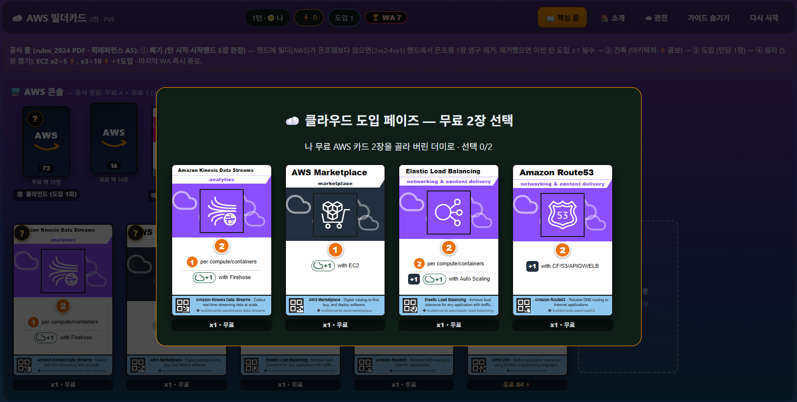
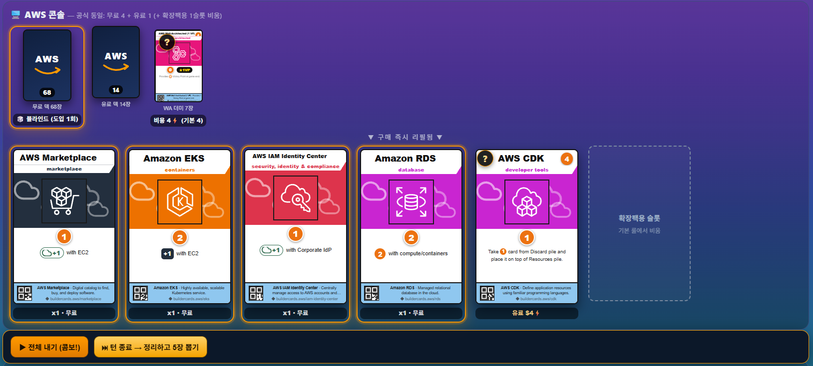
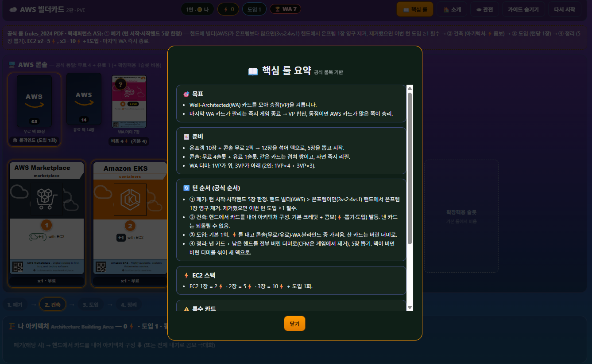
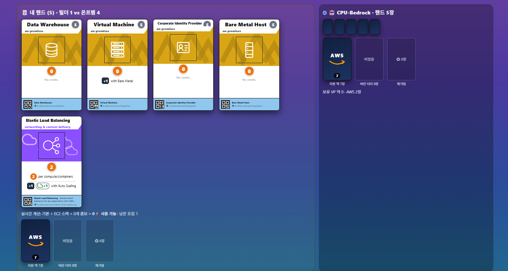

# AWS BuilderCards 2nd Edition — Fan Edition (Web)

[](./README.md)
[](./README.ko.md)
[](./README.md)
[](#-license--notice)
[](#-roadmap)
[](#-getting-started)
[](#-tech-stack)
[](#-tech-stack)
[](#-tech-stack)

A web-based, **unofficial fan edition** of the deck-building card game **AWS BuilderCards 2nd Edition**.
Start on-premises, build AWS architectures, and compete for Well-Architected points —
with **offline-identical rules**, starting with PVE.

> 📢 **Fan-made project.** This project is unofficial and is not affiliated with
> Amazon Web Services. AWS trademarks and card artwork belong to Amazon.com, Inc.
> or its affiliates. Please buy the physical cards from the
> [official sellers](#-play-with-the-physical-game).

- 🎮 Game: `#` (default view)
- 👁 Mat spectator view: `#observer`
- 🏠 Intro page: `#introduce`

## 📸 Screenshots

| Draft phase | Console market |
|---|---|
|  |  |
| Key-rules modal | Player hand & CPU |
|  |  |

## ✨ Features

- **Offline-identical rules engine** (`src/game/engine.ts`): 4-phase turns
  (retire → build → adopt → cleanup), EC2 stacking, all 41 card combos
- **PVE mode**: heuristic CPU bot (CPU-Bedrock) plays drafts, retires, and buys automatically
- **Poker-table game feel** (no gambling): card flip/fan motion, combo particles,
  WebAudio synth SFX
- **Official 2P mat spectator view**, turn stepper, key-rules modal, hover + touch tooltips,
  card quick-zoom (long-press), structured log, bot controls (pause/fast-forward)
- **PVP-ready**: fully serializable game state and action-based store —
  attach a WebSocket server to go multiplayer

## 🚀 Getting Started

```powershell
npm install
npm run dev      # http://localhost:5173
npm run build    # production build into dist/
```

Requires Node.js 20+.

## 📏 Rules (Official)

- **Setup**: 10 on-prem cards + 2 free console picks → shuffle 12 → draw 5
- **Console**: 4 free slots + 1 paid slot (duplicates stack, instant refill) +
  WA deck (1 VP on top) + blind draw. The 6th dashed slot is expansion-only and stays empty
- **Turn**: ① Retire (start of turn, starting hand only — more Builder than on-prem in hand
  → exile 1 on-prem from hand; must adopt ≥1 that turn) → ② Build (combos) →
  ③ Adopt (1/turn by default) → ④ Cleanup (discard everything, draw 5)
- **EC2 stacking**: 1× = 2⚡ · 2× = 5⚡ · 3× = 10⚡ + 1 adoption
- **Game end**: the moment the last WA card is taken → highest VP wins
  (ties broken by most AWS cards)

### Implementation notes vs. the original (verified)

| Item | Implementation | Source |
|---|---|---|
| On-prem credits | 0 (combo material only) | Builder's Guideline p.4 (CF 2 + S3 2 + VM = 4⚡) |
| Retire check | Starting 5-card hand, from hand only | Official rulebook + Quick Reference A5 |
| ELB combo | +2⚡ per compute/container | Builder's Guideline p.4 (3×2 = 6⚡) |
| Acquired WA cards | Go to discard (official "longer game" variant) | Rulebook (default is a separate pile) |
| Free pool | 76 cards (official contents list) | Rulebook p.11 (was 77 in the draft dataset — corrected: IAM ×3, Systems Manager ×2) |
| Starter | 10/color: 3× Bare Metal, no Code Repository | Rulebook p.11 contents |
| Architectures | Co-presence combo checks (no left/right sides, stacking, or split architectures) | Digital simplification |
| Blind adopt | 0⚡, consumes 1 adoption | Rulebook (no extra cost stated) |

## 🗂 Project Structure

```
src/
  game/       cards.json (CANONICAL card DB, KO/EN pairs — translators edit this file only)
              cards.ts (JSON loader + locale helpers) / engine.ts (pure rules) / bot.ts (PVE heuristic)
  ...
scripts/      cards.py (translation workflow: `cards:template` export / `cards:import` apply)
translation-template.csv  (translation sheet generated from cards.json)
```

## 🗺 Roadmap

- [x] PVE + offline-identical rules + spectator view + P0 UX
      (stepper, quick-zoom, guards, structured log, a11y, bot controls)
- [ ] P1: onboarding coach marks, buy confirmations, WA endgame tension, responsive pass
- [ ] PVP: WebSocket room server, action broadcast, hidden-hand spectating, reconnect

## 🛒 Play With the Physical Game

- Official page: https://aws.amazon.com/gametech/buildercards/
- Buy (Amazon, item `B0F13C68J6`): [US](https://www.amazon.com/dp/B0F13C68J6) ·
  [DE](https://www.amazon.de/dp/B0F13C68J6) · [FR](https://www.amazon.fr/dp/B0F13C68J6) ·
  [IT](https://www.amazon.it/dp/B0F13C68J6) · [ES](https://www.amazon.es/dp/B0F13C68J6) ·
  [NL](https://www.amazon.nl/dp/B0F13C68J6) · [PL](https://www.amazon.pl/dp/B0F13C68J6) ·
  [SE](https://www.amazon.se/dp/B0F13C68J6) · [BE](https://www.amazon.com.be/dp/B0F13C68J6) ·
  [SA](https://www.amazon.sa/dp/B0F13C68J6) · [AE](https://www.amazon.ae/dp/B0F13C68J6) ·
  [SG](https://www.amazon.sg/dp/B0F13C68J6) · [AU](https://www.amazon.com.au/dp/B0F13C68J6) ·
  [MX](https://www.amazon.com.mx/dp/B0F13C68J6)

## 📚 Credits & Sources

- Base rules PDF: https://pages.awscloud.com/rs/112-TZM-766/images/AWS-buildercards-rules_2024.pdf
- Builder's Guideline: https://pages.awscloud.com/rs/112-TZM-766/images/awsi-2025-AWSBuilderCards-BuildersGuideline.pdf
- Quick Reference A5: https://pages.awscloud.com/rs/112-TZM-766/images/AWS-BuilderCards-Quickreference-A5.pdf
- 2nd Edition announcement: https://aws.amazon.com/blogs/aws/aws-buildercards-second-edition-available-at-reinvent-2024-and-online/
- Icons: AWS Architecture Icons Asset Package (on-prem 4-tone palette and banner patterns recomposed by this fan project)

## ⚖️ License & Notice

- **Code** in this repository is provided under the MIT License.
- **Card artwork, icons, mat images, and AWS trademarks** belong to their respective
  owners (Amazon.com, Inc. and affiliates) and are **not** covered by that license.
  They will be removed or replaced immediately upon request from a rights holder.
